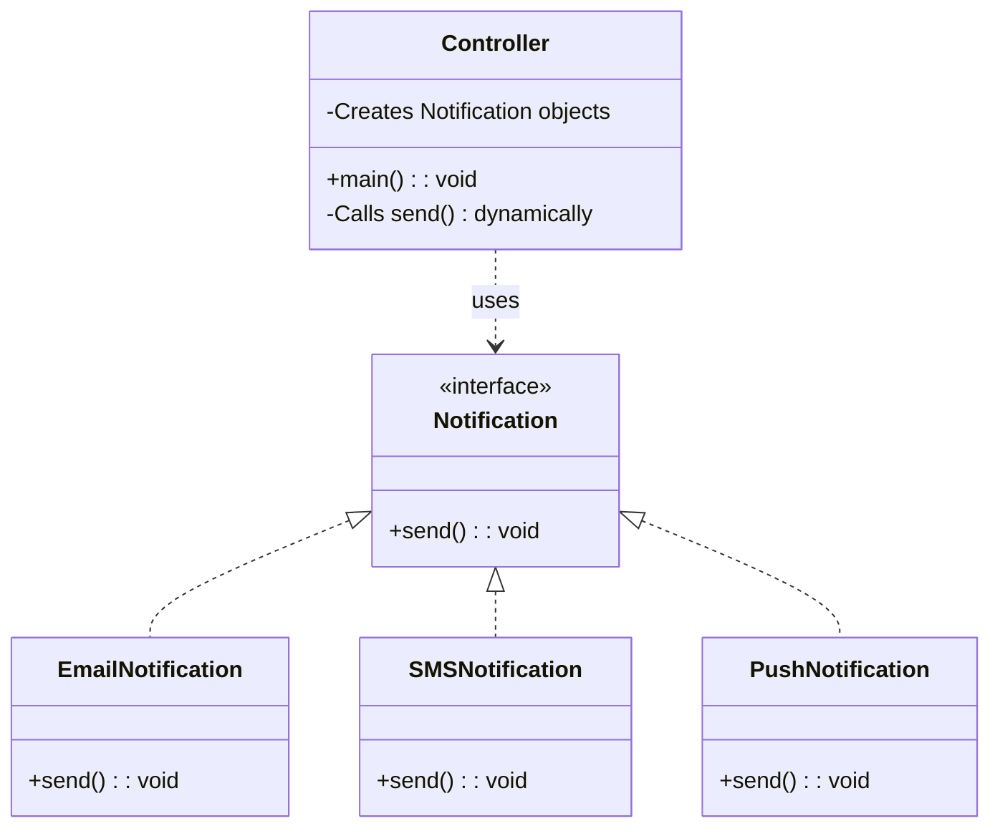

# This folder contains the individual project Notification System with Polymorphism

**The UML diagram:**


- Modules:
  - `NotificationSyatem` (library with various notification system)
  - `Controller` (console app)
  - `Tests` (module with tests)

### 1. **NotificationSystem**
- Defines the **Notification interface**.
- Implements concrete notification types:
  - `EmailNotification`
  - `SMSNotification`
  - `PushNotification`
- Each implementation overrides the `send()` method to demonstrate **polymorphism**.

---

### 2. **Controller**
- Acts as the **entry point** of the application.
- Responsible for:
  - Creating notification objects.
  - Calling their methods dynamically (via polymorphism).
  - Managing the flow of sending different notification types.

---

### 3. **Tests**
- Contains **JUnit 5** test cases.
- IntelliJ IDEA's **“Generate Test”** option was used to automatically create test stubs for:
  - Each class in `NotificationSystem`
  - The main `Controller` logic
- Ensures:
  - Correct instantiation of notifications
  - Proper method execution
  - System robustness for different inputs

---

## ⚙️ Technologies & Tools
- **Java 21**
- **Maven** (modular build + dependency management)
- **JUnit 5** (testing)
- **Checkstyle Plugin** (code quality)
- **IntelliJ IDEA** (development environment)

---

### Build and Run
```bash
# From the this folder
mvn clean install
mvn clean compile
mvn checkstyle:check
mvn test
```
